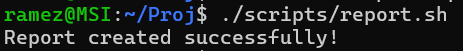
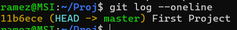

# Lab Report

## Commands Used

- mkdir
- touch
- chmod
- git init
- git add
- git commit
- git log --oneline

## Script Execution Screenshot

## Git Log Screenshot

---

## Questions

### 1. الفرق بين << و <
- < يستخدم لإعادة توجيه الإدخال من ملف
- << يستخدم لإدخال نص مباشر (Here Document)

### 2. لماذا نستخدم source بدل ./script.sh
- source يشغل السكربت في نفس الـ shell
- ./script.sh يشغله في shell جديد

### 3. الفرق بين | و ||
- | يمرر الخرج كمدخل لأمر آخر
- || ينفذ الأمر الثاني فقط إذا فشل الأول

### 4. لماذا نستخدم الفروع في Git
- لعزل التعديلات
- العمل على ميزات بدون التأثير على المشروع الرئيسي

### 5. ما وظيفة ssh-agent
- إدارة مفاتيح SSH وتخزينها لتسهيل الاتصال بدون إدخال كلمة المرور كل مرة